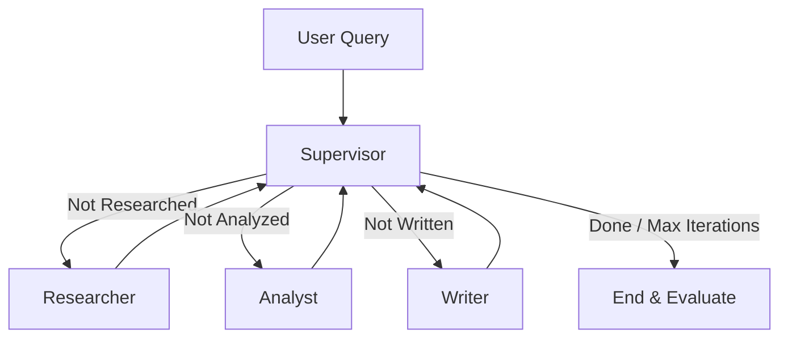

# Design Document: Multi-Agent Research Lab

## Problem

Hệ thống cần xử lý các yêu cầu nghiên cứu khoa học học thuật phức tạp (như thiết kế benchmark, lập kế hoạch thực nghiệm, viết báo cáo nghiên cứu sâu sắc). Các yêu cầu này đòi hỏi sự chính xác cao, trích dẫn nguồn thực tế, tư duy phân tích đa chiều và tuân thủ nghiêm ngặt các ràng buộc cấu trúc.

## Why multi-agent?

Một tác nhân duy nhất (Single-Agent) thường gặp khó khăn vì:
1. **Ảo giác nguồn tài liệu (Citation Hallucinations):** Rất dễ tự tạo ra các nguồn thông tin hoặc trích dẫn không tồn tại.
2. **Thiếu tính phản biện (Lack of critical analysis):** Xu hướng viết lách tuyến tính làm giảm chiều sâu phân tích và khó tự phát hiện các lỗi lập luận hoặc giả định ngầm định.
3. **Quá tải ngữ cảnh (Context Overload):** Khi vừa phải tìm kiếm thông tin, vừa lập luận phản biện, vừa định dạng văn bản trong cùng một lượt gọi, LLM dễ bỏ sót các ràng buộc quan trọng của prompt.

Thiết kế Multi-Agent cho phép chia nhỏ bài toán thành các phân đoạn chuyên biệt (Tìm kiếm - Phân tích Phản biện - Viết báo cáo) giúp tăng độ sâu nghiên cứu và tính chính xác cao.

## Agent roles

| Agent | Responsibility | Input | Output | Failure mode |
|---|---|---|---|---|
| **Supervisor** | Quyết định bước chạy tiếp theo và dừng đồ thị | `ResearchState` | Định tuyến tiếp theo (`route_history`) | Vòng lặp vô hạn (khắc phục bằng hard limit `MAX_ITERATIONS`) |
| **Researcher** | Tìm kiếm tài liệu, chắt lọc dữ liệu thô | `state.request.query` | `sources`, `research_notes` | Lọc thông tin nhiễu kém |
| **Analyst** | Đánh giá phản biện lập luận, so sánh các nguồn | `research_notes` | `analysis_notes` | Phân tích hời hợt hoặc lệch bias |
| **Writer** | Tổng hợp văn bản hoàn chỉnh, chèn trích dẫn học thuật | `research_notes`, `analysis_notes` | `final_answer` | Bỏ sót ràng buộc định dạng hoặc sai số chỉ mục citation |

## Shared state

- `request` (`ResearchQuery`): Chứa câu hỏi nghiên cứu, lượng nguồn tối đa, đối tượng độc giả.
- `sources` (`list[SourceDocument]`): Chứa danh sách các bài nghiên cứu thực tế tìm được.
- `research_notes` (`str`): Ghi chép thô từ Researcher.
- `analysis_notes` (`str`): Nhận định phản biện từ Analyst.
- `final_answer` (`str`): Bài viết hoàn thiện từ Writer.
- `route_history` (`list[str]`): Nhật ký định tuyến để Supervisor kiểm soát đường đi.
- `iteration` (`int`): Bộ đếm số bước chạy.

## Routing policy

Đồ thị điều phối tuần tự có cấu trúc:
1. **Supervisor** kiểm tra trạng thái -> Chuyển sang **Researcher** để tìm kiếm thông tin thô.
2. Từ Researcher quay về Supervisor -> Chuyển sang **Analyst** phân tích đánh giá.
3. Từ Analyst quay về Supervisor -> Chuyển sang **Writer** tổng hợp câu trả lời hoàn chỉnh.
4. Từ Writer quay về Supervisor -> Kết thúc đồ thị (`done` -> `END`).

## Guardrails

- **Max iterations:** Giới hạn tối đa 6 lượt chạy để chặn đứng vòng lặp vô hạn.
- **Timeout:** Khống chế thời gian chờ API.
- **Retry/Fallback:** Cơ chế tự động gọi lại 3 lần khi API OpenAI gặp lỗi tạm thời.
- **Validation:** Đảm bảo kiểu dữ liệu Pydantic và ép kiểu an toàn khi xuất kết quả đồ thị.

## Benchmark plan

- **Test Queries:** 4 prompt học thuật chuyên sâu từ [newREADME.md](file:///Users/tvtnoname/Documents/AI%20-%20Th%E1%BB%B1c%20chi%E1%BA%BFn%20Phase%202/Ng%C3%A0y%2020/phase2-day5-2A202600605-TranVanToan/newREADME.md).
- **Metrics:**
  - *Latency:* Wall-clock time (giây) toàn bộ luồng chạy.
  - *Cost:* Tính toán chi phí USD dựa trên số lượng token thực tế sử dụng.
  - *Quality:* Chấm điểm tự động (0.0 - 10.0) bằng LLM-as-a-Judge theo tiêu chí chặt chẽ.
  - *Citation Coverage:* Đánh giá tỷ lệ các bài báo được trích dẫn chính xác trong câu trả lời cuối.
